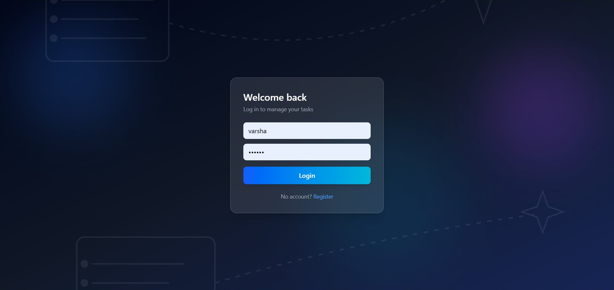
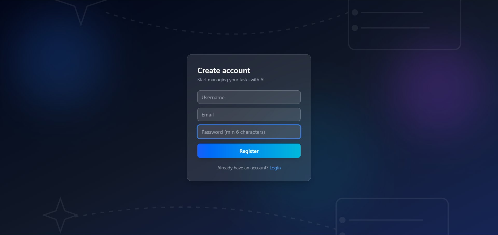
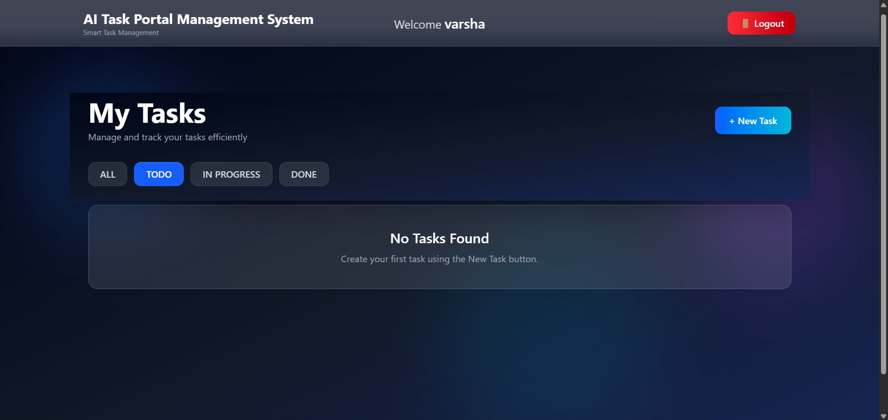
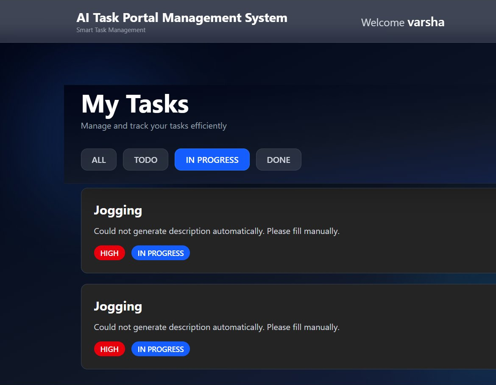
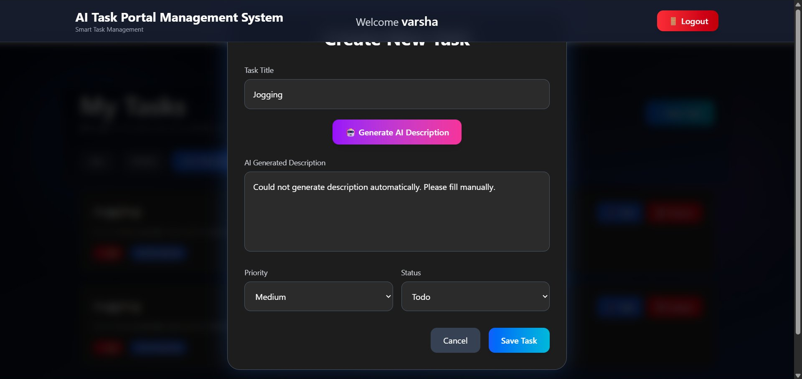

# AI-Powered Task Management Portal

A full-stack task management web application with JWT-based authentication and an AI-powered task automation feature. Users can register, log in, and manage their tasks (create, edit, delete, track status) through a clean, responsive dashboard. An AI assistant (powered by Google Gemini) can auto-generate a task description, priority, and estimated effort from just a task title.

**Live Demo:** [https://taskportal-frontend-nine.vercel.app](https://taskportal-frontend-nine.vercel.app)

> ⚠️ Note: The backend is hosted on Render's free tier, which spins down after periods of inactivity. The first request after idle time may take 30–50 seconds to respond while the server wakes up.

---

## Tech Stack

| Layer | Technology |
|---|---|
| Frontend | React 18, Vite, Tailwind CSS, Axios, React Router |
| Backend | Spring Boot 3.3, Spring Security, Spring Data JPA |
| Authentication | JWT (JSON Web Tokens) |
| Database | MySQL (hosted on Aiven) |
| AI Integration | Google Gemini API (`gemini-2.0-flash`) |
| Backend Hosting | Render (Docker-based deployment) |
| Frontend Hosting | Vercel |

---

## Architecture Overview

The application follows a classic three-tier architecture with a clean separation between presentation, business logic, and data persistence. The React frontend communicates with the Spring Boot backend exclusively through REST APIs secured with JWT. The backend talks to MySQL for persistence and to the Gemini API for AI-generated content.

```
React (Axios) → JWT in Authorization header → Spring Security filter chain
              → Controller → Service → Repository → MySQL

AI Flow: React form → Controller → AiService → Gemini REST API
              → parsed JSON → returned to frontend → auto-fills form fields
```

### Layered Backend Structure

| Layer | Responsibility | Example Classes |
|---|---|---|
| Controller | Expose REST endpoints, validate HTTP requests | `AuthController`, `TaskController`, `AiController` |
| Service | Business logic, orchestration, AI calls | `AuthService`, `TaskService`, `AiService` |
| Repository | Database access via Spring Data JPA | `UserRepository`, `TaskRepository` |
| Entity | JPA-mapped database tables | `User`, `Task` |
| Security | JWT generation, validation, filter chain | `JwtUtil`, `JwtAuthFilter`, `SecurityConfig` |
| DTO | Request/response shaping | `RegisterRequest`, `AuthRequest`, `AuthResponse`, `TaskRequest` |
| Exception | Centralized error handling | `GlobalExceptionHandler` |

---

## Folder Structure

**Backend** (Spring Boot)
```
taskportal/
└─ src/main/java/com/task/
   ├─ config/        → SecurityConfig.java
   ├─ controller/    → AuthController, TaskController, AiController
   ├─ dto/           → RegisterRequest, AuthRequest, AuthResponse, TaskRequest
   ├─ entity/        → User, Task
   ├─ enums/         → Priority, Status
   ├─ exception/     → GlobalExceptionHandler, ResourceNotFoundException
   ├─ repository/    → UserRepository, TaskRepository
   ├─ security/      → JwtUtil, JwtAuthFilter
   └─ service/       → AuthService, TaskService, AiService
└─ src/main/resources/
   └─ application.properties
└─ Dockerfile
```

**Frontend** (React + Vite)
```
task-portal-frontend/
├─ src/
│  ├─ api/           → axiosInstance.js, authApi.js, taskApi.js
│  ├─ context/       → AuthContext.jsx
│  ├─ components/    → Navbar, TaskCard, TaskForm, ProtectedRoute
│  ├─ pages/         → Login, Register, Dashboard
│  ├─ App.jsx
│  └─ main.jsx
├─ .env
└─ vite.config.js
```

---

## Setup Instructions (Local Development)

### Prerequisites
- Java 21
- Node.js (v18+)
- MySQL Server (local) or any MySQL-compatible cloud DB
- A Google Gemini API key from [aistudio.google.com](https://aistudio.google.com)

### Backend Setup
```bash
git clone https://github.com/Josuchintha63/taskportal-backend.git
cd taskportal-backend
```

Create the database:
```sql
CREATE DATABASE task_portal_db;
```

Configure `src/main/resources/application.properties`:
```properties
spring.datasource.url=jdbc:mysql://localhost:3306/task_portal_db
spring.datasource.username=root
spring.datasource.password=your_mysql_password

spring.jpa.hibernate.ddl-auto=update
spring.jpa.show-sql=true

jwt.secret=your_super_secret_key_minimum_256_bits
jwt.expiration=86400000

gemini.api.key=your_gemini_api_key
gemini.api.url=https://generativelanguage.googleapis.com/v1beta/models/gemini-2.0-flash:generateContent
```

Run the app:
```bash
./mvnw spring-boot:run
```
Backend runs on `http://localhost:8080`.

### Frontend Setup
```bash
git clone https://github.com/Josuchintha63/taskportal-frontend.git
cd taskportal-frontend
npm install
```

Create a `.env` file:
```
VITE_API_BASE_URL=http://localhost:8080/api
```

Run the dev server:
```bash
npm run dev
```
Frontend runs on `http://localhost:5173`.

---

## Deployment

| Component | Platform | Notes |
|---|---|---|
| Database | Aiven (MySQL, free tier) | Cloud-hosted, SSL-required connection |
| Backend | Render (Docker Web Service) | Free tier — cold starts after inactivity |
| Frontend | Vercel | Auto-deploys on push to `main` |

**Backend Environment Variables (Render):**
```
SPRING_DATASOURCE_URL
SPRING_DATASOURCE_USERNAME
SPRING_DATASOURCE_PASSWORD
SPRING_JPA_HIBERNATE_DDL_AUTO=update
JWT_SECRET
JWT_EXPIRATION
GEMINI_API_KEY
GEMINI_API_URL
```

**Frontend Environment Variable (Vercel):**
```
VITE_API_BASE_URL=https://taskportal-backend-r80g.onrender.com/api
```

**Live Links:**
- Frontend: https://taskportal-frontend-nine.vercel.app
- Backend: https://taskportal-backend-r80g.onrender.com
- Backend Repo: https://github.com/Josuchintha63/taskportal-backend
- Frontend Repo: https://github.com/Josuchintha63/taskportal-frontend

---

## API Endpoints

| Method | Endpoint | Auth Required | Description |
|---|---|---|---|
| POST | `/api/auth/register` | No | Register a new user |
| POST | `/api/auth/login` | No | Login, returns JWT token |
| GET | `/api/tasks` | Yes | Get all tasks for the logged-in user |
| POST | `/api/tasks` | Yes | Create a new task |
| PUT | `/api/tasks/{id}` | Yes | Update an existing task (owner only) |
| DELETE | `/api/tasks/{id}` | Yes | Delete a task (owner only) |
| POST | `/api/ai/generate-task-info` | Yes | Generate description, priority & effort from a task title via Gemini |

All protected endpoints require an `Authorization: Bearer <token>` header, attached automatically by the frontend's Axios interceptor.

---

## AI Integration

**Feature:** "Generate with AI" button on the task creation form.

**Workflow:**
1. User types only a task **title**.
2. Clicking **Generate with AI** sends a `POST` request to `/api/ai/generate-task-info` with `{ "title": "..." }`.
3. The backend (`AiService`) builds a structured prompt and calls the Google Gemini API.
4. Gemini's JSON response is parsed into `description`, `priority`, and `estimatedEffort`.
5. These values auto-fill the task form; the user can edit them before saving.

**Fallback Handling:** If the Gemini API call fails (invalid key, quota exceeded, network issue, or malformed response), the backend catches the exception and returns a safe default response instead of an error — the app never crashes, and the user can always fill the fields manually.

---

## Database Schema

### `users`
| Column | Type | Constraint |
|---|---|---|
| id | BIGINT | PK, AUTO_INCREMENT |
| username | VARCHAR | UNIQUE, NOT NULL |
| email | VARCHAR | UNIQUE, NOT NULL |
| password | VARCHAR | NOT NULL (BCrypt hash) |

### `tasks`
| Column | Type | Constraint |
|---|---|---|
| id | BIGINT | PK, AUTO_INCREMENT |
| title | VARCHAR | NOT NULL |
| description | VARCHAR(2000) | |
| priority | ENUM | LOW / MEDIUM / HIGH |
| status | ENUM | TODO / IN_PROGRESS / DONE |
| due_date | DATE | |
| created_at | DATETIME | set on insert |
| user_id | BIGINT | FK → users.id |

**Relationship:** One `User` has many `Task` records (one-to-many). Ownership is enforced both at the database level (foreign key) and at the service layer (every update/delete re-checks that the task belongs to the requesting user).

> Database Schema Attached:
     - Aiven Database Screenshot
     - Users Table Structure
     - Tasks Table Structure


## Screenshots

> ### Login Page


### Register Page


### Dashboard (Empty)


### Dashboard (With Tasks)


### AI Feature


## Assumptions

- Single assignee per task (no multi-user task sharing or collaboration).
- No email verification step required at registration.
- JWT tokens expire after 24 hours; the user must log in again after expiry.
- Each user can only view, edit, or delete their own tasks.

---

## Challenges Faced

- **Java version mismatch in Docker deployment:** The initial Dockerfile used a Java 17 base image while the project was compiled for Java 21, causing a `release version 21 not supported` build failure on Render. Fixed by updating both build and runtime stages to `eclipse-temurin:21`.
- **Missing database tables in production:** `spring.jpa.hibernate.ddl-auto=update` was only set in the local (gitignored) `application.properties`, so Hibernate never created tables in the production database. Fixed by adding `SPRING_JPA_HIBERNATE_DDL_AUTO=update` as a Render environment variable.
- **CORS errors between Vercel and Render:** Resolved by explicitly adding the deployed Vercel domain to `allowedOrigins` in `SecurityConfig`.
- **Browser autofill on the login form:** Fixed by adding explicit `name` and `autoComplete` attributes to the username/password inputs.

---

## Author
--**Chintha Jyoshna**
--MCA Graduate (2025).
--Java Full Stack Developer.
--GitHub: [Josuchintha63](https://github.com/Josuchintha63)
